# KMRE
## Overview
KMRE is a system environment compatible with Android APP designed by Kylin team for "Kylin OS", which is used to meet the diverse needs of users for application software.Users can install and run Android apps in KYLIN operating system by KMRE, such as WeChat, qqlite, stocks, video apps etc.

### Technical Features
1）KMRE is already compatible with a large number of Android apps and takes only a second to boot.

2）There is no performance, KMRE uses graphics hardware.

3）Android App integration with Linux window display.

4）Support multi-program running.

5）Resolution dynamic adaptation,free rotation and UHD.

6）The input method is unified, the system input method can be used in the APP.

7）Same audio device, voice support.

8）Support the use of camera to take photos, video and video calls, support camera hot swap, plug and play.

9）Document,clipping board, application management intercommunication.

10）Support WeChat, qqlite new message notification.

11）Support WeChat tablet mode login and mobile WeChat online at the same time.

12）Support WeChat, qqlite and other Apps to drag and drop files for sharing.

13）Support Android app to access Linux files directly.

14）The files in Android can be opened with the default tool on the Linux.

15）Support Android App quick screenshot sharing, and recording screen sharing.

16）Support Android App to share Linux desktop.

17）Support the scaling of pictures and documents in Android App.

18）Support game key settings.

19）System compatibility, security, stability greatly improved after upgrading to Android 10.

 

## Care Instruction
Due to the technical design of Android system and the sharing of hardware resources between KMRE and Kylin operating system, in order to achieve a better use experience, users are advised to read the following notes and known issues carefully:

1）The performance of APP will be greatly improved when using SSD compared to using mechanical hard disk;

2）Do not run more than 4 apps at the same time(Android typically has only one active App running on the front end);

3）Recommended memory 8GB or more;

4）CPU support: FT1500A, FT-2000/4, FT-D2000/8,  Kirin990, Kirin9006C, Hygon, ZHAOXIN, Kunpeng920, Intel and AMD;

5）Graphics support：NVIDIA, AMD, INTEL, MALI, JJM, GP101 and ZHAOXIN;

6）The voice and video calls were normal but the video was abnormal for qqlite;

7）You need to pause other audio/video playback when using Communication software. Otherwise, audio and video calling software may run into the problem of not hearing the other person's voice;

8）The current version may have a green screen when using the camera on some machines;

9）The machine with a WiFi device, such as a laptop or a desktop computer with Wireless network card. Before starting KMRE, you need to make sure that the WiFi switch is on. Otherwise, if you start KMRE when WiFi is off, all the apps in KMRE will not be connected to the Internet;

10）The screen brightness adjustment feature for video apps will not work;

11）The PIP is not supported;

12）Positioning and sensors are not supported;

13）DingTalk login, if you use the DingTalk to punch in or other functions, you need to log out the account in the KMRE, otherwise there may be "virtual positioning software punch in";

14）Lanxin requires the phone to log out of the account before the voice call function can be used;

15）If the Android App can't connect to the Internet, please check whether the docker network configuration conflicts with the local LAN network configuration;

16）Virtual machine is not supported.

17）Super user root is not supported.

18）The reason why some applications (such as Zhihu) have no network may be related to the wrong time of Linux OS. The time of Android is synchronized with that of Linux. Some Android applications have their own network detection mechanism. When the time of Android is not the current time, App may be forbidden to use the network; The solution to this problem is: Linux synchronizes the current time.

 

## Start and close
- Start KMRE: start method 1) click the "mobile application" button at the top of the software store interface to initialize KMRE first, as shown in Figure 1. After KMRE initialization is completed, the mobile application list will appear on the "mobile application" page of the software store, and the mobile application can be installed and started on the mobile application list page; Startup mode 2) start from the start menu.

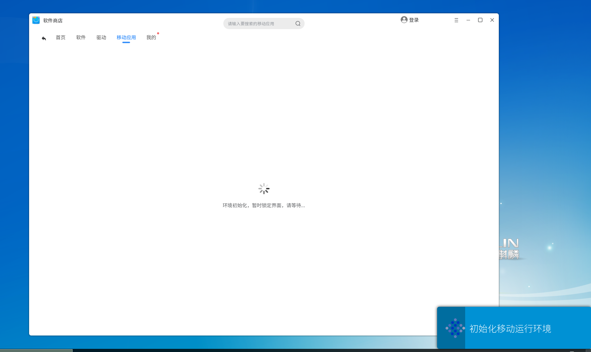

- Close KMRE: click the "menu" icon on the title bar of any mobile application interface, and select "help" - > "close KMRE" in the pop-up menu to close KMRE and close the graphical windows of all mobile applications.

 

## Install and uninstall
- Install App: install through the software store or double-click APK package locally.

- Uninstall App: uninstall method 1) enter the "software store" - > "my" - > "application uninstall" page, select the software to be uninstalled, and click the "uninstall" button to start uninstallation; uninstall method 2) open the start menu, right-click the application to be unloaded, and then click "uninstall".

 

## Input
- Chinese input: KMRE and Kylin share the input method. After switching the Chinese input method, you can directly input Chinese in the input box of the mobile application, as shown in Figure 2.

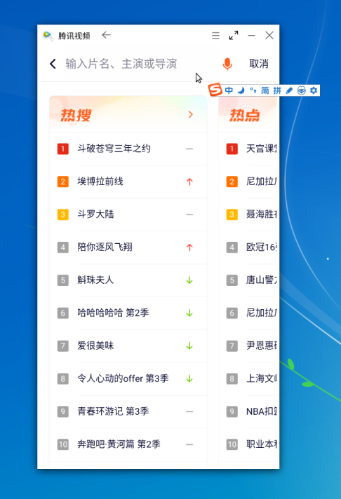

- Key input: KMRE supports keyboard key input, including keypad and various key combinations, such as Ctrl+C, Ctrl+V, Ctrl+A, etc.

 

## File sharing
- View mobile phone stored files: click the "menu" icon on the title bar of any mobile application interface,  select "Open Storage" in the pop-up menu to view all file directories stored on the mobile phone in the file manager.

- Drag and drop files for sharing: drag and drop a file (only files in the current user's home directory) from the Kylin to the mobile application interface, and you can select friends to share and forward.

- File sending: in the WeChat chat interface, select "+" - > "file" - > "mobile storage" - > "0-Kylin file" to send the files under the Kylin OS home directory to WeChat friends, as shown in Figure 3.

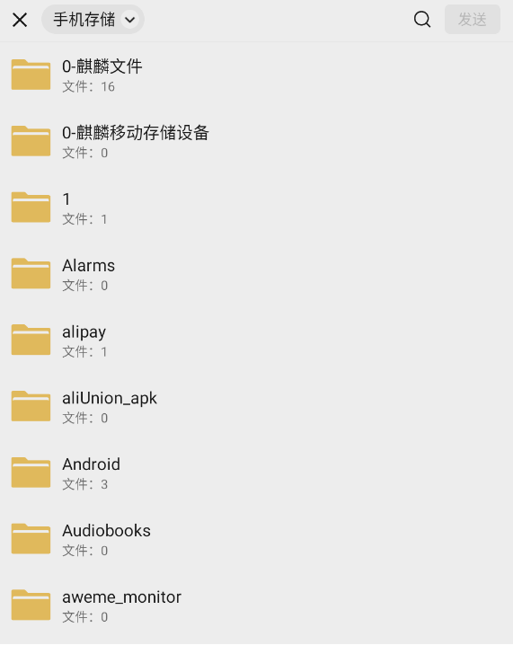

- Kylin software opens the file in the mobile application: long press the file received in WeChat with the left mouse button, click "open other applications" in the pop-up menu, and select "open local application", then the file can be opened with the tools associated with Kylin OS.

 

## Convenient operation
- Zoom in and out: KMRE supports zoom in and out of pictures and document contents: press and hold the "Ctrl" key and the left mouse button to move back and forth.

- Mouse locked in the window: Press F2 to lock the mouse in the window. Press F2 again to unlock the mouse.

- Window topping: Click the "Top" icon on the title bar of any mobile application interface to make the mobile application interface in the top state, click again to cancel the top.

- Screenshot sharing: Click the "Screenshot" icon on the title bar of any mobile application interface to use the screenshot tool to take a screenshot and share it with friends. According to the Kylin screenshot version, the "hide the current window while taking a screenshot" function is provided, and the screenshot sharing function is only supported on wechat and QQ for the time being.

- Open the setting interface: Click the "Menu" icon on the title bar of any mobile application interface and choose "Settings" from the pop-up menu to quickly enter the setting interface.

- Keyboard and Mouse handle: Click the "Menu" icon on the title bar of any mobile application and choose Keyboard and Mouse Handle from the displayed menu to enter the screen for setting the keyboard and mouse handle. This setting can be performed only on non-parallel screens.

- Shake: Click the "Menu" icon on the title bar of any mobile app and choose "Shake" from the pop-up menu to use the shake function.

- Vertical/Horizontal Switching: Click the "Menu" icon on the title bar of any mobile application and choose Vertical/Horizontal Switching from the displayed menu. For applications that support vertical/horizontal switching, you can switch based on the current application display status.

- Screen recording and sharing: Click the "Menu" icon on the title bar of any mobile application interface and choose "Screen recording" in the pop-up menu to start recording. After recording, you can directly share it with your friends. The screen recording and sharing function only supports wechat and QQ for the time being.

- Virtual keyboard: Click the "Menu" icon on the title bar of any mobile application and choose Virtual Keyboard from the displayed menu to enter information using the virtual keyboard.

- Virtual location: Click the "Menu" icon on the title bar of any mobile application interface, choose "Virtual Location" in the menu that pops up, enter the location keyword in the virtual location interface, select the location as prompted, and click this location to send the selected location to KMRE.

- Open the Mobile Data Directory: Click the "Menu" icon on the title bar of any mobile application interface and choose "Move Data" from the pop-up menu to quickly open the KMRE Mobile data directory.

- Open the configuration screen: Tap the Menu icon on the title bar of any mobile application and choose Configure from the displayed menu to quickly enter the configuration screen.

- Adjust the sensitivity of the mouse wheel: Click the "Menu" icon on the title bar of any mobile application interface and choose "Wheel Sensitivity" from the pop-up menu to adjust the sensitivity of the mouse wheel.

 

## Configuration
- Display mode switching: KMRE provides two display modes, performance mode and compatibility mode. The performance mode is only applicable to AMD and Intel graphics card, and the compatibility mode is applicable to all graphics cards, as shown in Figure 4.The display interface is displayed only when both modes are applicable.

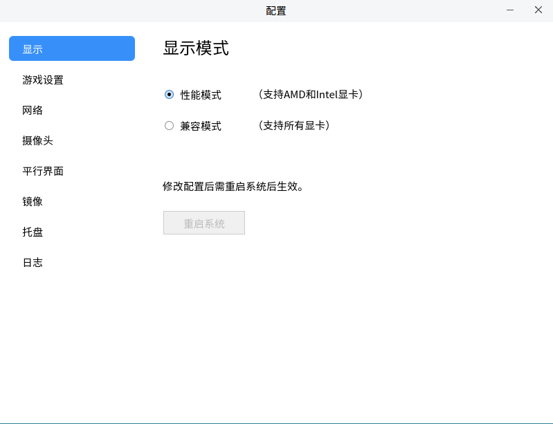

- Renderer switching: KMRE provides a list of four renderers for users to choose, among which "default" is automatically selected by Android according to the hardware environment. You can modify it in the renderer page through the configuration portal, as shown in Figure 5.When display mode is in performance mode, the renderer screen is not displayed.

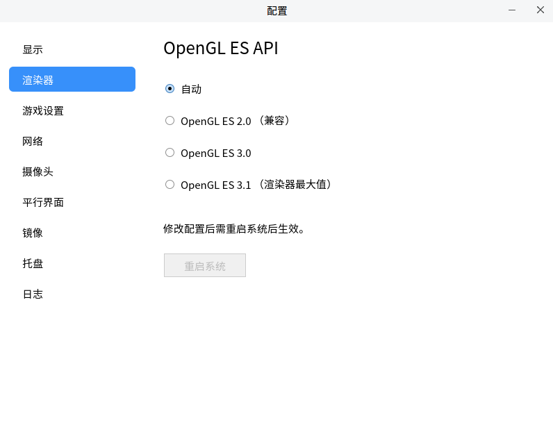

- Game key white list setting: on the "game" page of the configuration interface, games can be added to or removed from the whitelist, as shown in Figure 6. Click the "menu" icon on the title bar of the mobile application interface, select "game keys" in the pop-up menu to start key setting, as shown in Figure 7, and the game operation effect is shown in Figure 8.

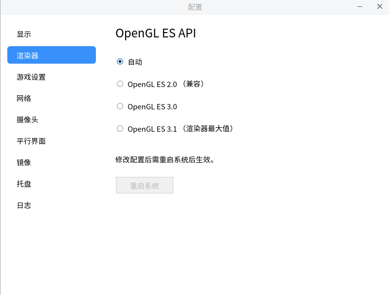

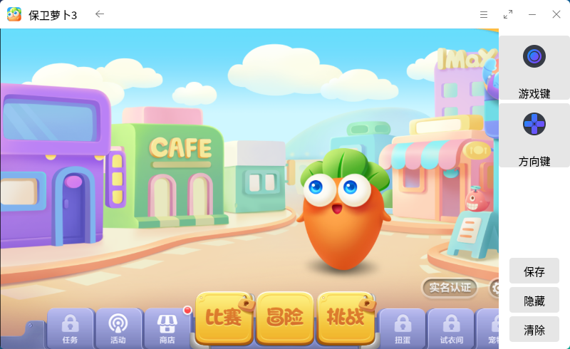

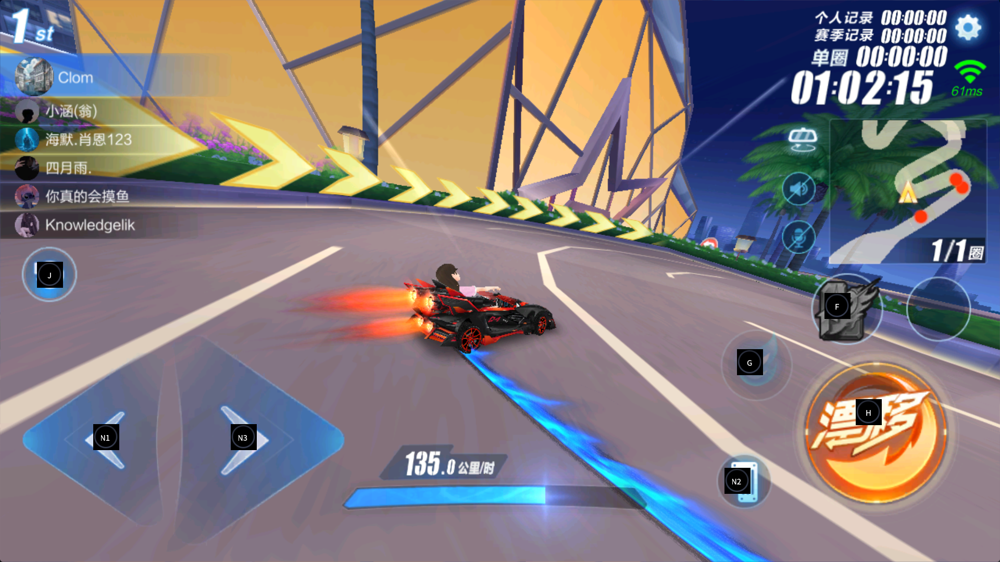

- Modify the network configuration: if the default network segment of docker is the same as the LAN segment where the user system is located, such as the network segment beginning with 172, network conflict will be caused, resulting in abnormal network access of Kylin OS and KMRE. Click the "configuration" icon on the title bar of any mobile application interface to enter the "network" page of the configuration interface, and you can modify the default network of the container, as shown in Figure 9.

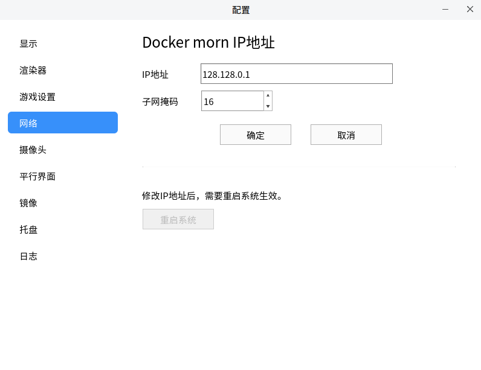

- Camera switching: as shown in Figure 10, switch the camera used by KMRE.

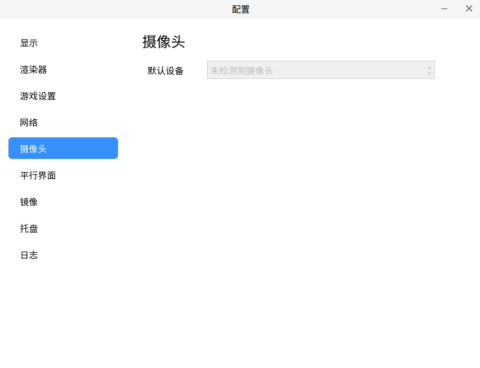

- App Multiplier: as shown in Figure 11, set whether the application enables the app multiplier display mode.Currently, parallel interface applications are supported: wechat, Tencent News, QQ, Toutiao, Bilibili, iqiyi, Sina Weibo, Sina News, NetEase News, JINGdong, NetEase News, Watermelon Video, Autohome, Meituan, Dianping, Douyu, huya. Applications can be displayed on the parallel screen only after they are installed.

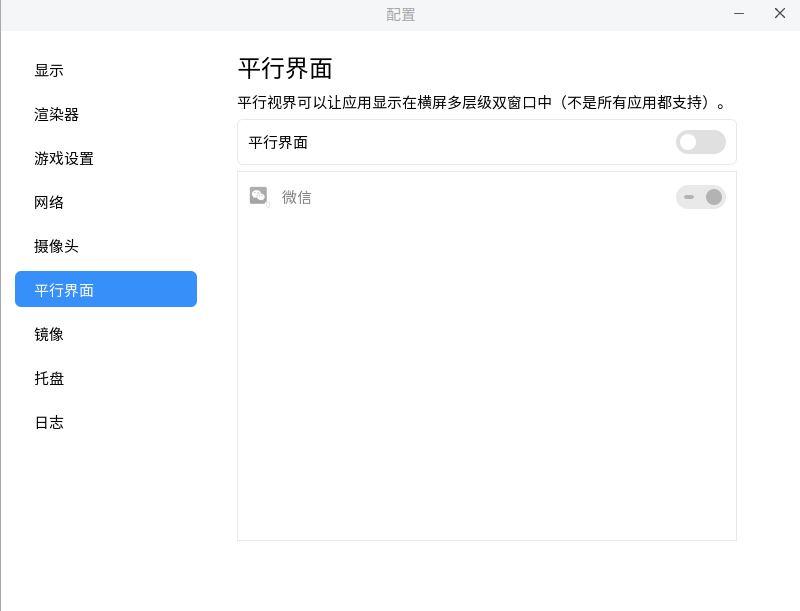

- Image cleaning: as shown in Figure 12,  select images to clean up or clean up all idle images at one time to save hard disk storage space.

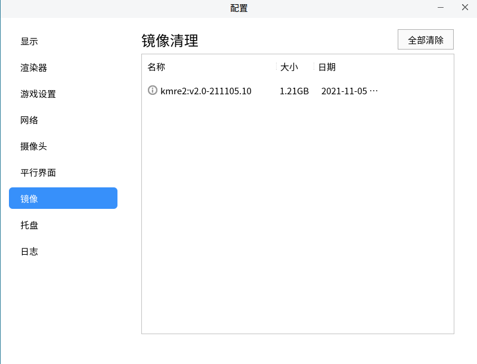

- SystemTray Icon: as shown in Figure 13, set whether the application displays the tray. After the application sets the tray display, click Close button in the titlebar, the application will not exit.

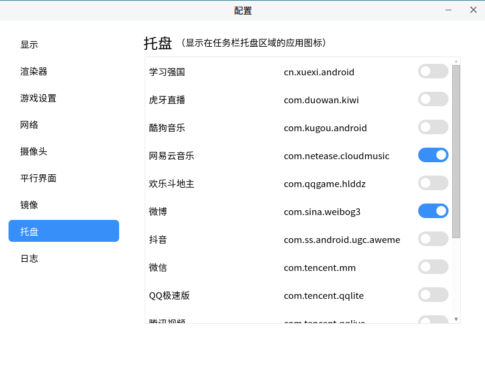

- Log collection: as shown in Figure 14, collect logs to facilitate problem tracking and location.

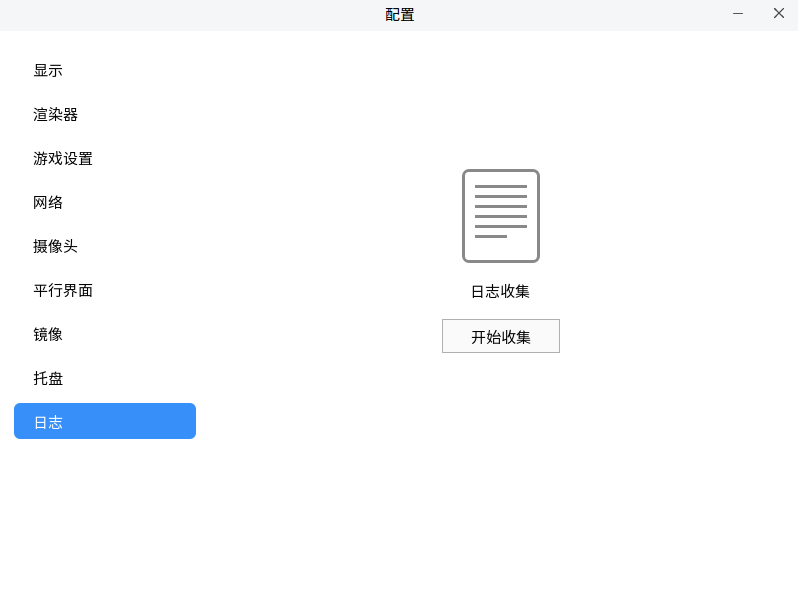

 

## Developer mode debug
- Open developer debugging:
1) Click General Settings -> Version number 5 times to display the Developer mode screen.
2) Open the KMRE Settings interface -> Developer debugging can be turned on.
3)Docker exec-it kmre-1000-kylin ifconfig check kmre IP address.
4) Connect to the KMRE device via adb Connect IP.

- Disable developer debugging: Open KMRE Settings interface -> Developer debugging can be turned off.

 
