# KMRE
## Overview
KMRE is a system environment compatible with Android APP designed by Kylin team for "Kylin OS", which is used to meet the diverse needs of users for application software.Users can install and run Android apps in KYLIN operating system by KMRE, such as WeChat, qqlite, stocks, video apps etc.

### Technical Features
1）KMRE is already compatible with a large number of Android apps and takes only a second to boot.

2）There is no performance, KMRE uses graphics hardware.

3）Android App integration with Linux window display.

4）Support multi-program running.

5）Resolution dynamic adaptation（Headline、QQ、QQ lite、QQ HD、WPS Office、QQ Mail、Netease Mail、Netease news）

6）The input method is unified, the system input method can be used in the APP.

7）Same audio device, voice support.

8）Support the use of camera to take photos, video and video calls, support camera hot swap, plug and play.

9）Document,clipping board, application management intercommunication.

10）Support WeChat, qqlite new message notification.

11）Support WeChat tablet mode login and mobile WeChat online at the same time.

12）Support WeChat, qqlite and other Apps to drag and drop files for sharing.

13）Support Android app to access Linux files directly.

14）The files in Android can be opened with the default tool on the Linux.

15）Support Android App quick screenshot sharing, and recording screen sharing.

16）Support Android App to share Linux desktop with specified screen.

17）Support the scaling of pictures in Android App.

18)  Support Android App booting with full screen.

19)  Support Android App multiplier display mode.

20）Support game key settings.

21) Support virtual location.
    
22) Support global or separate network proxy.
    
23）Support switching docker network mode between bridge and host;

24) Support Android App cloning (only wechat and QQ)

25）System compatibility, security, stability greatly improved after upgrading to Android 11.

 

## Care Instruction
Due to the technical design of Android system and the sharing of hardware resources between KMRE and Kylin operating system, in order to achieve a better use experience, users are advised to read the following notes and known issues carefully:

1）The performance of APP will be greatly improved when using SSD compared to using mechanical hard disk;

2）It is recommended not to run multiple apps at the same time on poor hardware (experience depends on actual hardware performance);

3）Recommended memory 8GB or more;

4）CPU support: FT1500A, FT-2000/4, FT-D2000/8,Kirin990, Kirin9006C, Hygon, ZHAOXIN, Kunpeng920, Intel and AMD;

5）Graphics support：NVIDIA, AMD, INTEL, MALI, JJM, GP101, X100 and ZHAOXIN;

6）The voice and video calls were normal but the video was abnormal for qqlite;

7）You need to pause other audio/video playback when using Communication software. Otherwise, audio and video calling software may run into the problem of not hearing the other person's voice;

8）The current version may have a green screen when using the camera on some machines;

9）The machine with a WiFi device, such as a laptop or a desktop computer with Wireless network card. Before starting KMRE, you need to make sure that the WiFi switch is on. Otherwise, if you start KMRE when WiFi is off, all the apps in KMRE will not be connected to the Internet;

10）The screen brightness adjustment feature for video apps will not work;

11）The PIP is not supported;

12）Positioning and sensors are not supported;

13）DingTalk login, if you use the DingTalk to punch in or other functions, you need to log out the account in the KMRE, otherwise there may be "virtual positioning software punch in";

14）Lanxin requires the phone to log out of the account before the voice call function can be used;

15）If the Android App can't connect to the Internet, please check whether the docker network configuration conflicts with the local LAN network configuration;

16）Virtual machine is not supported.

17）Super user root is not supported.

18）The reason why some applications (such as Zhihu) have no network may be related to the wrong time of Linux OS. The time of Android is synchronized with that of Linux. Some Android applications have their own network detection mechanism. When the time of Android is not the current time, App may be forbidden to use the network; The solution to this problem is: Linux synchronizes the current time.

19）Projection is not supported.

20）Please use the software payment function carefully to prevent property damage.

 

## Start and close
- Start KMRE: start method 1) Start mobile application from the system start menu; Startup mode 2) Enter the "mobile application" page in software store, after KMRE initialization is completed, the mobile application list will appear on this page, and then start the specified mobile application.
- Close KMRE: click the "menu" icon on the title bar of any mobile application interface, and select "setting" to open settings UI, then switch to "Advanced settings" page. Close KMRE and all started mobile applications by clicking "Close Kmre" button. Uninstall KMRE by clicking "Uninstall Kmre" button and clearing user data with "Clear user data" checkbox checked.
 

## Install and uninstall
- Install App: install method 1) Enter the "mobile application" page in software store, then install specified mobile application. install method 2) Double-click Android APK package locally and then installing.
- Uninstall App: uninstall method 1) Enter the "mobile application" page in software store, then uninstall specified mobile application. uninstall method 2) open the system start menu, right-click the application to be uninstalled, and then click "uninstall".
 

## Input
- Chinese input: KMRE and Kylin share the input method. After switching the Chinese input method, you can directly input Chinese in the input box of the mobile application, as shown in Figure 2.
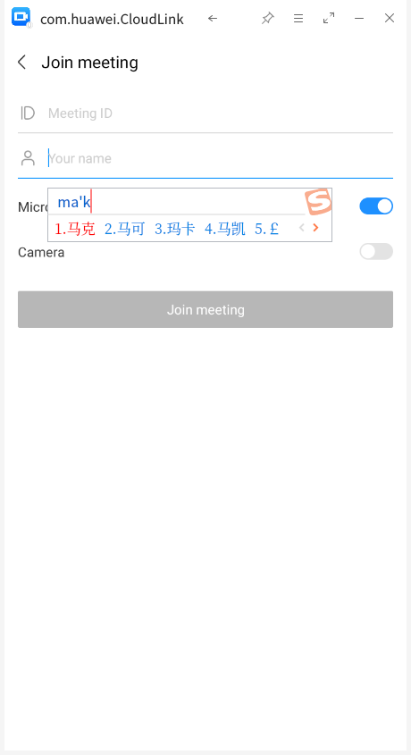
- Key input: KMRE supports keyboard key input, including keypad and various key combinations, such as Ctrl+C, Ctrl+V, Ctrl+A, etc.
 

## File sharing
- Aggregate Android files: click "file manager" - > "quick access" - > "KMRE" to view, edit and copy four types of files in the Android system, namely pictures, videos, audio and documents.
- View mobile phone stored files: click the "menu" icon on the title bar of any mobile application interface,  select "Open Storage" in the pop-up menu to view all file directories stored on the mobile phone in the file manager.
- Drag and drop files for sharing: drag and drop a file (The file size limit for file sharing in /home/username, /var/log, /data, and /media directories is determined by the application. The file size limit for other directories is less than 100 MB) from the Kylin to the mobile application interface, and you can select friends to share and forward. 3 apps only support photo sharing, namely iQiyi, Toutiao and Evernote. Drag the file to wechat (wechat version >=8.0.19), Dingpin and QQ (excluding QQ Speed version, QQHD) chat window, no need to select the contact, directly send the file to the corresponding contact; Non-current contact chat window drag file sharing, users can select the corresponding contact to send.
- File sending: in the WeChat chat interface, select "+" - > "file" - > "mobile storage" - > "0-Kylin file" to send the files under the Kylin OS home directory to WeChat friends, as shown in Figure 3.
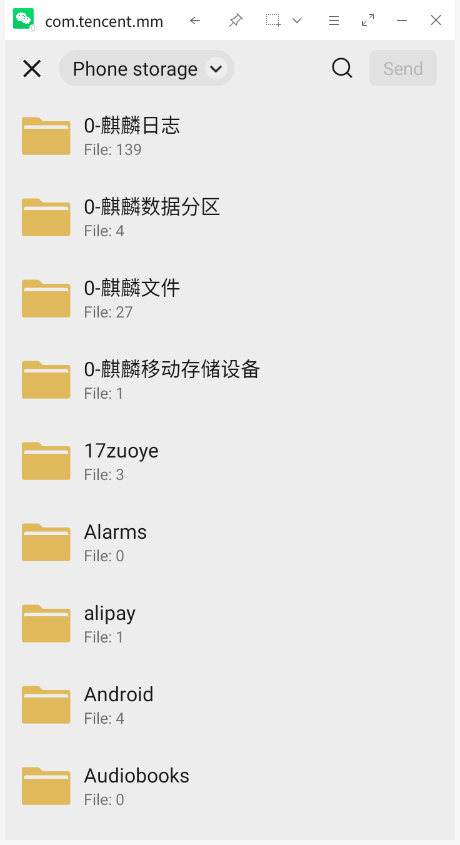
- Kylin software opens the file in the mobile application: long press the file received in WeChat with the left mouse button, click "open other applications" in the pop-up menu, and select "open local application", then the file can be opened with the tools associated with Kylin OS.
 

## Convenient operation
- Zoom in and out: KMRE supports zoom in and out of pictures and document contents: press and hold the "Ctrl" key and the left mouse button to move back and forth.
- Mouse locked in the window: Press F2 to lock the mouse in the window. Press F2 again to unlock the mouse.
- Custom file saving: supports custom path saving of common types of files (such as pictures, videos, documents, etc.) that need to be manually downloaded in wechat, wechat Enterprise Edition, QQ, TIM, Dingding, NetEase mailbox, AND QQ Mailbox; All files in wechat, QQ, Dingding and non-forwarded messages that can be saved to the mobile phone by clicking three points (or long press) in the upper right corner can be customized. QQ mailbox, NetEase mailbox: mail with attachments, attachments can be customized and saved to any location.
- Dynamic resolution: The application window can be stretched freely, and the application resolution can be automatically adjusted according to the window size, so as to maintain a clear and high-definition display effect. Currently, the supported applications are QQ Speed Edition, QQ mobile edition, WPS Office, Toutiao.
- Window topping: Click the "Top" icon on the title bar of any mobile application interface to make the mobile application interface in the top state, click again to cancel the top.
- Screenshot sharing: Click the "Screenshot" icon on the title bar of any mobile application interface to use the screenshot tool to take a screenshot and share it with friends. According to the Kylin screenshot version, the "hide the current window while taking a screenshot" function is provided, and the screenshot sharing function is only supported on wechat and QQ for the time being.
- Open the setting interface: Click the "Menu" icon on the title bar of any mobile application interface and choose "Settings" from the pop-up menu to quickly enter the setting interface.
- Keyboard and Mouse handle: Click the "Menu" icon on the title bar of any mobile application and choose Keyboard and Mouse Handle from the displayed menu to enter the screen for setting the keyboard and mouse handle. This setting can be performed only on non-parallel and non-dynamic screens.
- Shake: Click the "Menu" icon on the title bar of any mobile app and choose "Shake" from the pop-up menu to use the shake function.
- Screen recording and sharing: Click the "Menu" icon on the title bar of "wechat" or "QQ" and choose "Screen recording" in the pop-up menu to start recording. After recording, you can directly share it with your friends.
- App multipler: Click the "Menu" icon on the title bar of supported mobile applications, enter "App settings" secondray menu then choose "App multipler".
- booting fullscreen:Click the "Menu" icon on the title bar of any mobile applications, enter "App settings" secondray menu then choose "booting fullscreen".
- App cloning:Click the "Menu" icon on the title bar of "wechat" or "QQ", enter "App settings" secondray menu then choose "App cloning".
- Virtual keyboard: Click the "Menu" icon on the title bar of any mobile application and choose Virtual Keyboard from the displayed menu to enter information using the virtual keyboard.
- Open the Mobile Data Directory: Click the "Menu" icon on the title bar of any mobile application interface and choose "Move Data" from the pop-up menu to quickly open the KMRE Mobile data directory.
- Open the configuration screen: Tap the Menu icon on the title bar of any mobile application and choose Configure from the displayed menu to quickly enter the configuration screen.
 

## Configuration
- General Settings: In the general Settings interface, you can set KMRE startup, application quantity limit, camera, Docker network, and log collection. The switching function of transcode library is only available to X86, as shown in Figure 4. In the bridge mode of Docker nerwork, if the default network segment is the same as that of the local area network where the user system resides, such as the network segment starting with 172, network conflict will occur, resulting in abnormal network access between Kylin system and KMRE. Tap the Configuration icon on the title bar of any mobile application interface to enter the 'common settings' page of the configuration interface. You can modify the default network settings of the container.
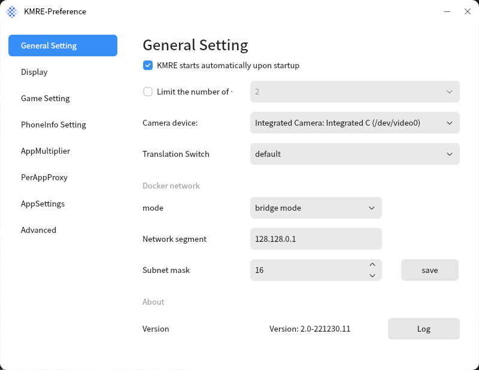
- Display Settings: KMRE provides two display modes, performance mode and compatibility mode. Performance mode applies only to AMD and Intel graphics cards, compatibility mode applies only to all graphics cards, and display mode switchover is displayed only when both modes are applicable. KMRE offers a list of four renderers to choose from, with android automatically selecting a renderer "by default" based on the hardware environment. Users can modify the display mode in the "Renderer" page through the "Configuration" entry. When the display mode is in the performance mode state, the renderer is switched to not display. The display interface is shown in Figure 5.
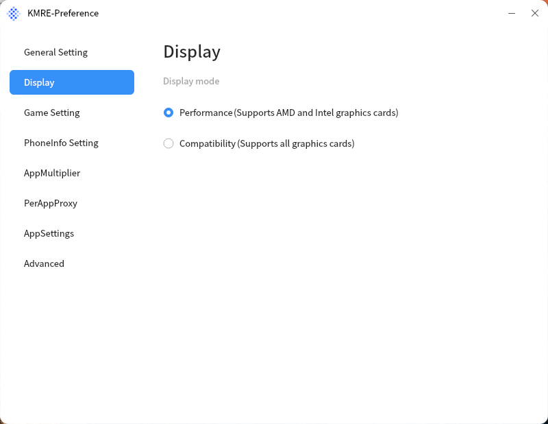
- Game Settings: on the "Game Settings" page of the configuration interface, you can enable ASTC texture support, which will make the picture quality clearer, as shown in Figure 6. Click the "Menu" icon on the title bar of the supported mobile application interface, and choose "Keyboard and Mouse Handle" from the pop-up menu to start setting keys, as shown in Figure 7. The effect is shown in Figure 8.
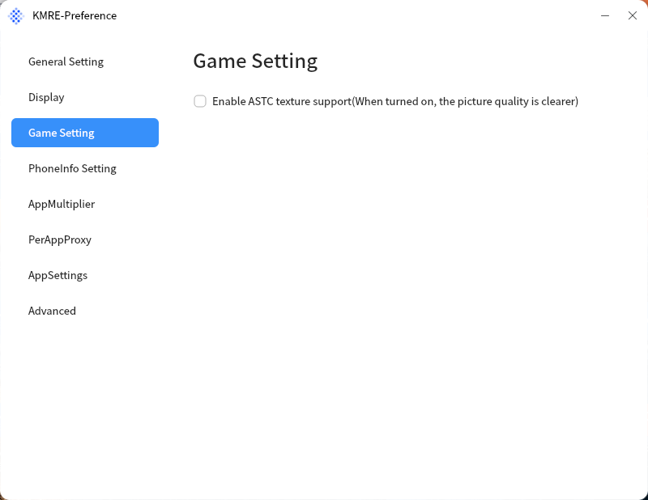
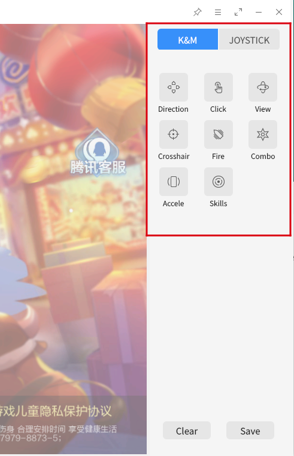
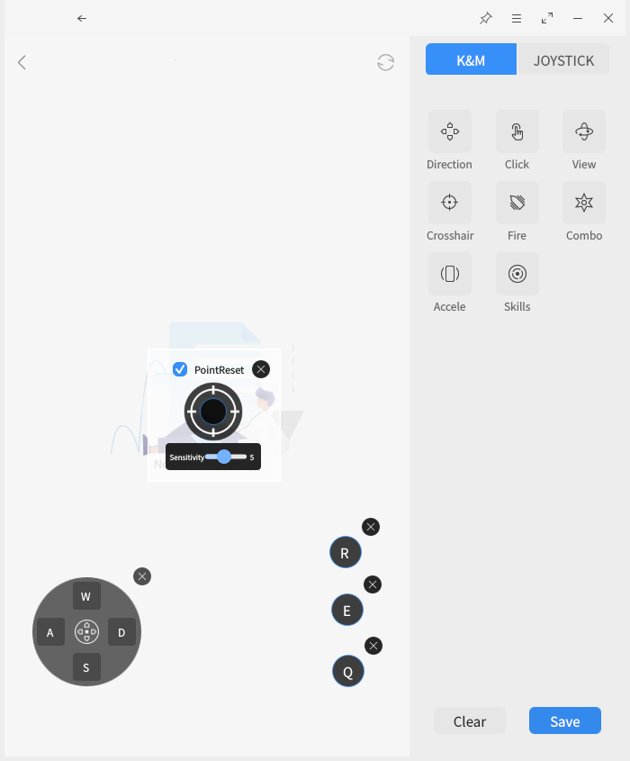
- PhoneInfo setting: KMRE brand, model and IMEI number can be set. There are two options: preset model and custom model, as shown in Figure 9.
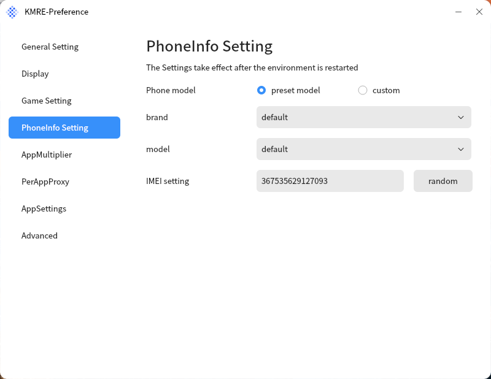
- App Multiplier: as shown in Figure 10, set whether the application enables the app multiplier display mode.Currently, parallel interface applications are supported: wechat, Tencent News, QQ, Toutiao, Bilibili, iqiyi, Sina Weibo, Sina News, NetEase News, JINGdong, NetEase News, Watermelon Video, Autohome, Meituan, Dianping, Douyu, huya. Applications can be displayed on the parallel screen only after they are installed.Currently, only NVIDIA, AMD, and INTEL graphics cards support parallel interface Settings.
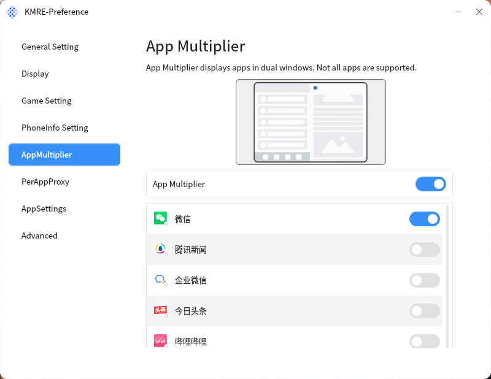
- Per-App Proxy: as shown in Figure 11, set whether the app uses Network Proxy alone. When the system network proxy is set, all applications use the proxy network by default, but after turning on this per-app proxy switch, applications can independently set whether to use the proxy.
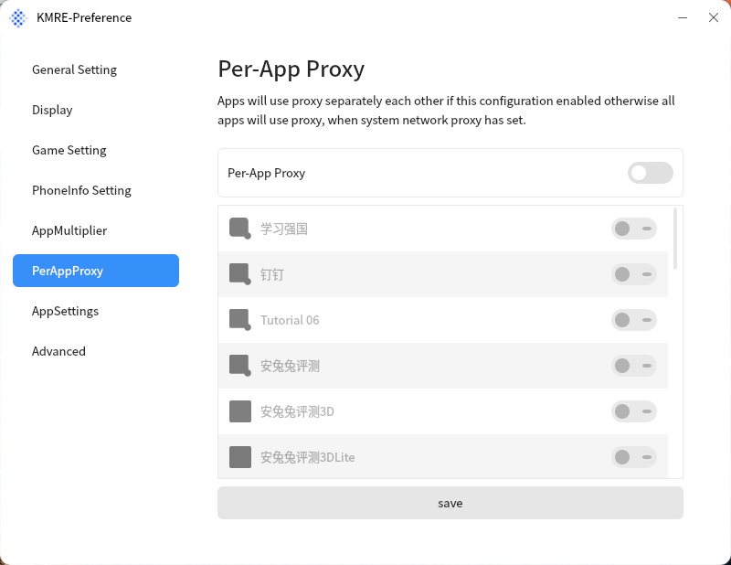
- SystemTray Icon: as shown in Figure 12, set whether the application displays the tray. After the application sets the tray display, click Close button in the titlebar, the application will not exit.
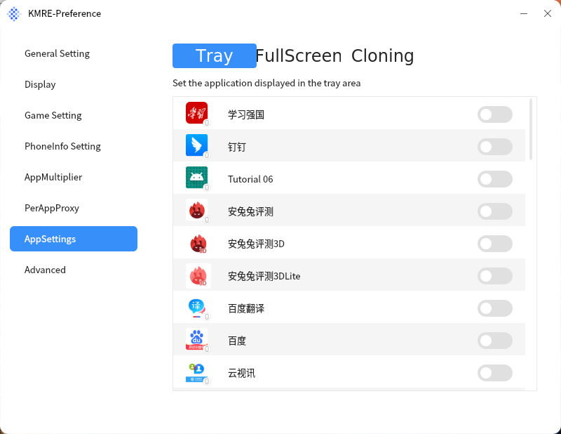
- Booting full-screen: as shown in Figure 13, set whether the app launches in full screen. After the app sets full-screen launch, it will launch in full-screen on each launch.
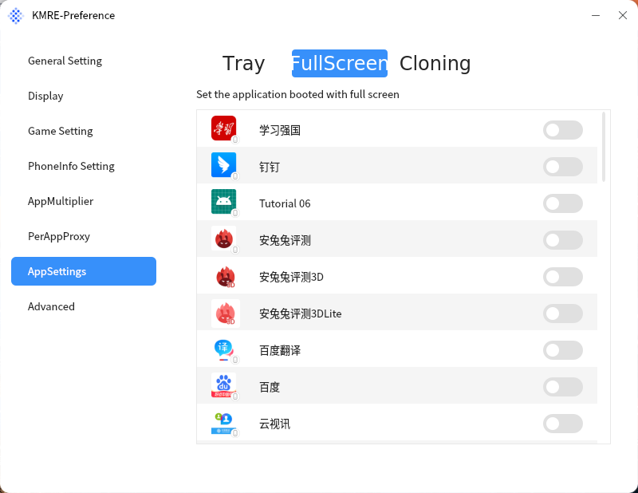
- App cloning: as shown in Figure 14, set whether to enable app cloning. After the app cloning is enabled, the cloning app will be created, and you can log in to a different account within the cloning app.
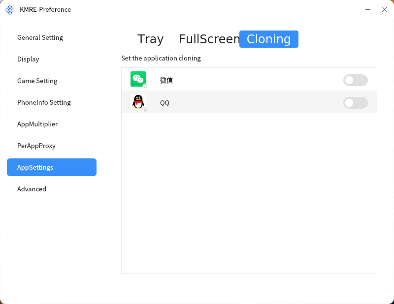
- Advanced settings: as shown in Figure 15, set the wheel sensitivity, turn off the KMRE environment, uninstall the KMRE environment, and view the virtual position.
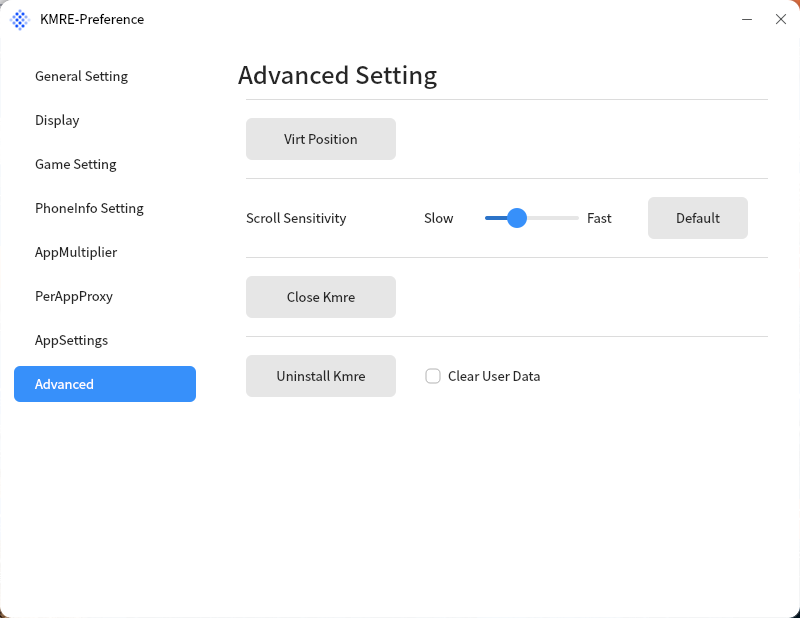
- Developer debugging: As shown in Figure 16, click the "Current Version xxx" button continuously on the "General Settings" interface to open the "Developer Mode" configuration, in which you can enable the KMRE application development, installation, and debugging switch.
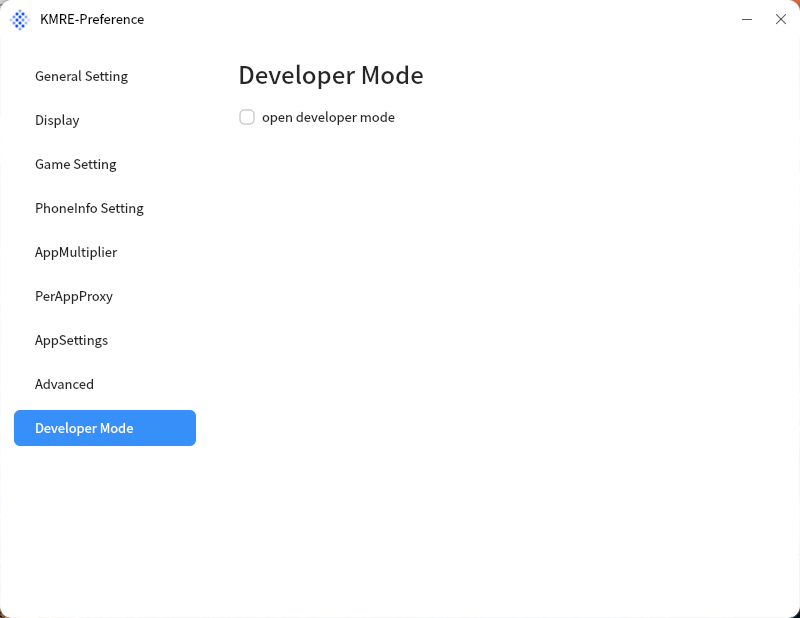
 

## Developer mode debug
- Open developer debugging:
1) Click General Settings -> Version number 5 times to display the Developer mode screen.
2) Open the KMRE Settings interface -> Developer debugging can be turned on.
3) Docker exec-it kmre-$UID-$USER ifconfig check kmre IP address.
4) Connect to the KMRE device via adb Connect IP.
- Disable developer debugging: Open KMRE Settings interface -> Developer debugging can be turned off.
 
