# 麒麟移动运行环境
## 概 述
麒麟移动运行环境（KMRE）是麒麟团队专为“银河麒麟操作系统”打造的一款兼容安卓App运行的系统环境，用于满足用户对应用软件的多样化需求。KMRE能够让用户在银河麒麟操作系统中安装和运行安卓App，比如游戏、微信、QQ极速版、股票、视频类App等。

### 技术特点
1）支持海量安卓App，一秒启动。

2）可直接使用显卡硬件，无性能损失。

3）安卓App与Linux窗口显示融合。

4）支持多个App同时运行。

5）部分App支持分辨率动态适应，高分辨率真全屏模式。（今日头条、QQ、QQ 极速版、QQ HD、WPS Office、QQ邮箱、网易邮箱、网易新闻）

6）统一输入法，使用Linux输入法在安卓App中输入文字。

7）统一音频设备，支持语音聊天。

8）支持使用摄像头拍照、录像和视频通话，支持摄像头热插拔，即插即用。

9）文件互通，文字剪切板互通，应用管理统一。

10）支持微信、QQ极速版的新消息通知。

11）支持微信平板模式登录，和手机微信同时在线。

12）支持微信、QQ极速版等应用拖拽文件进行分享。

13）支持安卓App直接访问Linux端文件。

14）支持安卓内的文件使用Linux端的默认工具打开。

15）支持安卓App快速截图分享和录屏分享。

16）支持安卓App自由选择指定的屏幕进行共享Linux桌面。

17）支持安卓App内图片缩放。

18）支持配置安卓App全屏启动。

19）支持安卓App平行界面（双窗口）显示。（仅部分App支持）

20）支持游戏按键设置。

21）支持虚拟定位功能。

22）支持全局网络代理以及分应用网络代理。

23）支持自由切换Docker网络模式（桥接模式、主机模式）。

24）支持安卓App应用分身（仅支持微信、QQ）。

25）升级到安卓11，兼容性、安全性、稳定性大幅提升。

 

## 用前必读
因安卓系统本身技术设计，以及KMRE与银河麒麟操作系统共用硬件资源的原因，为了达到较好的使用体验效果，建议用户仔细阅读以下注意事项和已知问题：

1）安卓App在使用固态硬盘时性能会相较于使用机械硬盘有较大提升（安卓操作系统为手机操作系统，其磁盘操作对机械硬盘支持较差）；

2）在较差的硬件设备上建议不要同时运行多个App（使用体验取决于实际硬件性能）；

3）电脑内存建议8G或以上；

4）当前版本支持的处理器包括FT1500A、FT-2000/4、FT-D2000/8、Kirin990、Kirin9006C、Hygon、ZHAOXIN、Kunpeng920、Intel和AMD；

5）当前版本支持的显卡包括：NVIDIA、AMD、INTEL、MALI、JJM、GP101、X100和ZHAOXIN；

6）QQ极速版语音和视频通话正常，但是录像显示异常；

7）在使用音视频通话软件时，需要暂停其他音频/视频的播放，否则音视频通话软件可能会遇到听不到对方声音的问题；

8）当前版本在有些机器上使用摄像头可能存在绿屏现象；

9）带有wifi设备的机器，如笔记本或者台式机插入了无线网卡，这类机器在启动Kmre环境之前，需要保证wifi开关处于开启状态，否则如果wifi开关处于关闭状态时启动Kmre环境，则Kmre环境里的App都无法联网；

10）视频类应用调节屏幕亮度功能不会生效；

11）视频类应用不支持“画中画”功能；

12）不支持定位和传感器相关功能；

13）“钉钉”应用登录后，如在钉钉上使用到打卡等功能，需要先在Kmre环境中登出账号，否则可能出现“虚拟定位软件打卡”问题；

14）“蓝信+”应用，需要在手机上登出账号后，语音通话功能才能成功呼出；

15）如果安卓应用无法连接互联网，请检查是否是docker网络配置与本机局域网的网络配置存在冲突；

16）不支持虚拟机；

17）不支持超级用户root使用；

18）部分应用（如知乎）出现无网络的原因可能与Linux系统时间不对有关，安卓系统内部与Linux系统时间同步，某些安卓应用内部有自己的网络检测机制，当安卓系统时间不是当前时间时，可能会禁止应用使用网络；解决该问题的方法是：Linux系统同步当前时间。

19）不支持投屏；

20）请慎重使用软件支付功能，防止造成财产损失。

 

## 启动和关闭
- 启动KMRE：启动方式1）安卓App安装后，可在系统的开始菜单找到相应的启动项，点击即可启动该App。启动方式2）进入“软件商店”->“移动应用”页面，等待初始化完毕后即可在该页面找到所有已安装的安卓App，点击即可启动指定的安卓App。
- 关闭/卸载KMRE：点击任何一个移动应用界面标题栏上的“菜单”图标，在弹出的菜单中点击“设置”选项打开KMRE设置界面，并进入“高级设置”页面，点击“关闭KMRE环境”按钮即可将KMRE关闭，同时关闭所有移动应用的图形窗口。点击“一键卸载KMRE环境”按钮即可将KMRE环境卸载，若同时勾选了“清除用户数据”则会将KMRE用户数据一并清除。
 

## 安装和卸载
- 安装应用：安装方式1）进入“软件商店”->“移动应用”页面，点击安装已支持的安卓App。安装方式2）手动下载apk安装包到本地，直接双击apk包进行安装（不推荐）。
- 卸载应用：卸载方式1）进入“软件商店”->“我的”->“应用卸载”页面，选中需要卸载的软件，点击“卸载”按钮开始卸载；卸载方式2）打开开始菜单，在需要卸载的应用上点击鼠标右键，然后点击“卸载”。
 

## 输 入
- 中文输入：KMRE和麒麟系统共享输入法，切换中文输入法后，可以直接在移动应用的输入框中输入中文，如图 2所示。
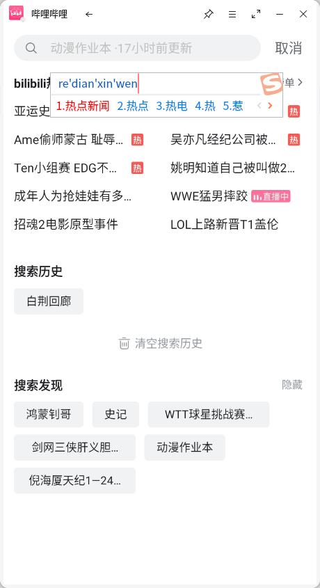
- 按键输入：KMRE支持键盘按键输入，包括小键盘和各类组合键，如Ctrl+C、Ctrl+V、Ctrl+A等。
 

## 文件互通
- 聚合显示安卓文件：点击“文件管理器”->“快速访问”->“移动数据”，可以分类查看、编辑和拷贝安卓系统内的四类文件，分别是图片、视频、音频和文档。
- 查看手机存储文件：点击任何一个移动应用界面标题栏上的“菜单”图标，在弹出的菜单中选择“移动数据”，即可在文件管理器中查看手机存储的各类文件目录。
- 拖拽文件进行分享：从麒麟系统端拖拽一个文件（/home/username、/var/log、/data、/media目录下的文件分享时文件大小限制由应用本身决定，其他目录下文件大小限制为小于100M）到移动应用的界面，可以选择好友进行分享转发。其中3款应用只支持图片分享，分别是爱奇艺、今日头条、印象笔记。拖拽文件到微信（微信版本>=8.0.19）、钉钉和QQ（不包括QQ极速版、QQHD）的聊天窗口时，无需进行联系人的选择，直接发送此文件给对应的联系人；非当前联系人聊天窗口拖拽文件分享，可供用户选择对应联系人发送。
- 文件发送：在微信聊天界面，选择“+”->“文件”->“手机存储”->“0-麒麟文件”,即可将麒麟系统端家目录下的文件发送给微信好友，如图 3所示。
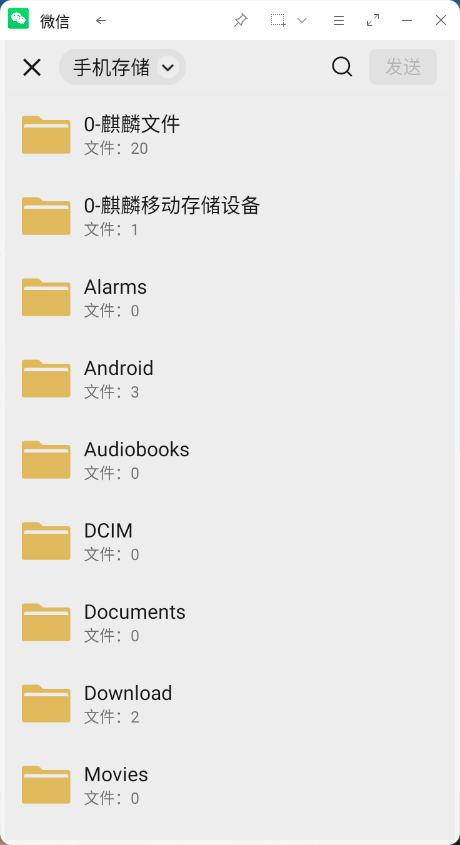
- 麒麟端软件打开移动应用内的文件：鼠标左键长按微信内收到的文件，在弹出的菜单中点击“其他应用打开”，选择“本地应用打开”，则可以用麒麟系统端关联的工具打开文件。
 

## 便捷操作
- 放大缩小：KMRE支持对图片和文档内容的放大缩小：按住“Ctrl”键，并按住鼠标左键进行前后左右移动。
- 鼠标锁定在窗口内：按下F2，鼠标锁定在窗口内，再次按下F2解除鼠标锁定。
- 文件自定义保存：支持微信、微信企业版、QQ、TIM、钉钉、网易邮箱、QQ邮箱中需要手动下载的常见类型文件（如图片、视频、文档等）的能自定义路径保存；微信、QQ、钉钉，非转发消息中的所有可以点击右上角三个点（或长按）保存到手机的文件均可以自定义保存；QQ邮箱、网易邮箱：带附件邮件，附件文件可以自定义保存到任意位置。
- 动态分辨率：部分应用窗口可以自由拉伸，应用分辨率根据窗口大小自动适应，保持清晰高清的显示效果，目前支持的应用有QQ极速版、QQ手机版、wps office、今日头条。
- 窗口置顶：点击任何一个移动应用界面标题栏上的“置顶”图标，即可让该移动应用界面处于置顶状态，再次点击取消置顶。
- 截图分享：点击任何一个移动应用界面标题栏上的“截图”图标，即可使用截图工具进行截图并分享给好友。根据麒麟截图版本提供“截图时隐藏当前窗口”功能，截图分享功能暂时只支持微信和QQ。
- 打开设置界面：点击任何一个移动应用界面标题栏上的“菜单”图标，在弹出的菜单中选择“设置”，即可快速进入设置界面。
- 键鼠手柄：点击移动应用界面标题栏上的“菜单”图标，在弹出的菜单中选择“键鼠手柄”，即可进入键鼠手柄设置界面，该设置仅在不支持动态分辨率的非平行界面下才可进行。
- 摇一摇：点击任何一个移动应用界面标题栏上的“菜单”图标，在弹出的菜单中选择“摇一摇”，即可使用摇一摇功能。
- 录屏分享：点击微信或QQ应用界面标题栏上的“菜单”图标，在弹出的菜单中选择“录屏”，即可开始录屏，录屏完成后，可直接分享给好友。
- 平行界面：点击支持平行界面的应用界面标题栏上的“菜单”图标，在弹出的菜单中展开“应用配置”二级菜单，选择“平行界面”即可开启平行界面模式。
- 全屏启动：点击任何一个移动应用界面标题栏上的“菜单”图标，在弹出的菜单中展开“应用配置”二级菜单，选择“全屏启动”即可以全屏方式启动该应用。
- 应用分身：点击微信或QQ应用界面标题栏上的“菜单”图标，在弹出的菜单中展开“应用配置”二级菜单，选择“应用分身”即可启用该应用的分身应用。
- 虚拟键盘：点击任何一个移动应用界面标题栏上的“菜单”图标，在弹出的菜单中选择“虚拟键盘”，即可使用虚拟键盘输入。
- 打开移动数据目录：点击任何一个移动应用界面标题栏上的“菜单”图标，在弹出的菜单中选择“移动数据”，快速打开KMRE移动数据的目录。
 

## 配 置
- 通用设置：在通用设置界面可以对KMRE开机自启动，应用数量限制，摄像头，Docker网络进行设置，同时可以进行日志收集操作，转码库切换功能仅对X86开放，如图4所示。在Docker网络桥接模式下，如果默认的网段与用户系统所在的局域网网段一样，如172开头的网段，则会造成网络冲突，导致麒麟系统和KMRE访问网络异常。点击任何一个移动应用界面标题栏上的“配置”图标，进入配置界面的“通用设置”页面，则可以对容器的默认网络配置进行修改。
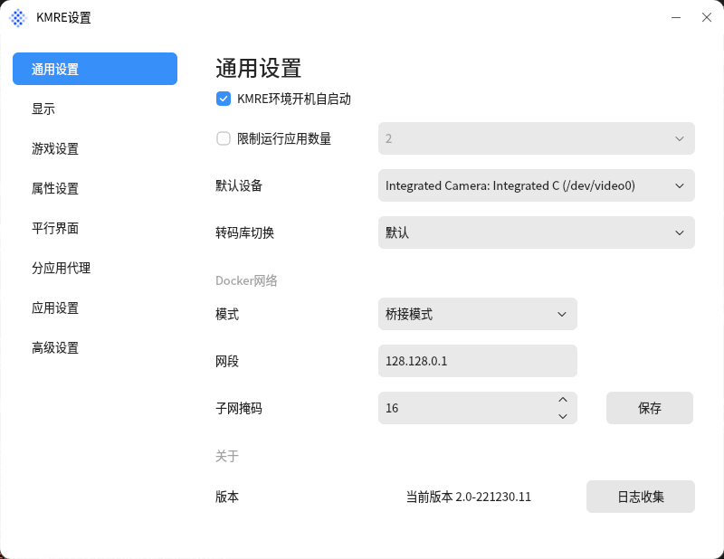
- 显示设置：KMRE提供两种显示模式，性能模式和兼容模式，其中性能模式只适用于AMD和Intel显卡，兼容模式适用于所用显卡，显示模式切换仅在两种模式都适用时才显示。KMRE提供四种渲染器列表供用户选择，其中“默认”由安卓根据硬件环境自动选择渲染器。用户可以通过“配置”入口，在“渲染器”页面中进行修改，显示模式处于性能模式状态时，渲染器切换不显示。显示界面如图5所示。
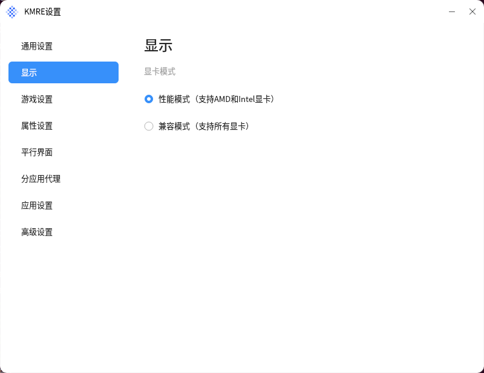
- 游戏设置：在配置界面的“游戏设置”页面，可以开启ASTC纹理支持，开启后画质更清晰，如图6所示。键鼠手柄仅对非动态分辨率应用且未开启平行界面的KMRE应用开放，点击移动应用界面标题栏上的“菜单”图标，在弹出的菜单中选择“键鼠手柄”，开始进行按键设置，如图 7所示，使用效果如图 8所示。
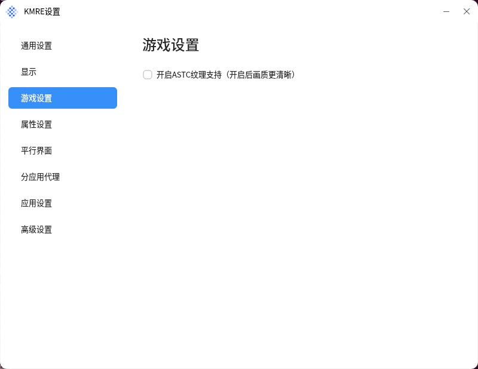
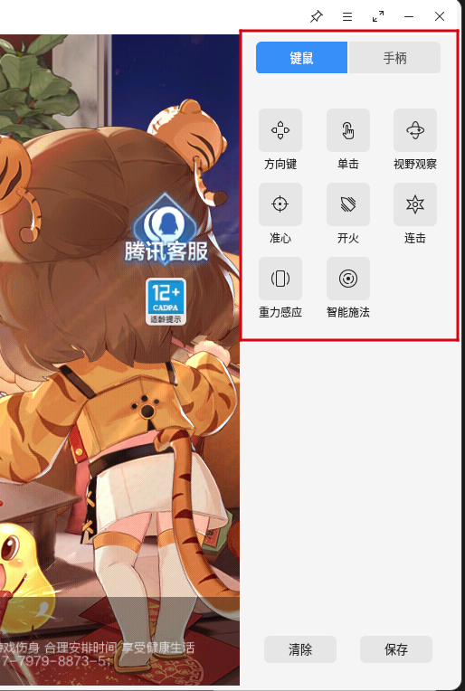
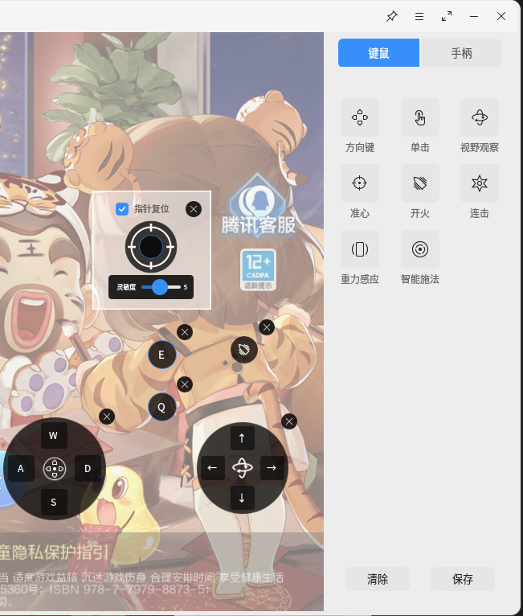
- 属性设置：可设置KMRE品牌、型号和IMEI编号，有预设型号和自定义型号两种选择，如图 9所示。
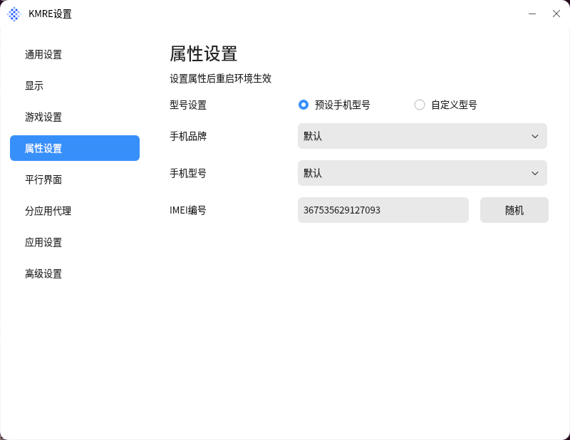
- 平行界面：如图 10所示，设置应用是否启用平行界面显示模式。目前平行界面已支持应用有：微信、腾讯新闻、极速版QQ、今日头条、哔哩哔哩、爱奇艺、新浪微博、新浪新闻、网易新闻、京东、网易新闻、西瓜视频、汽车之家、美团、大众点评、斗鱼、虎牙。安装应用后平行界面列表方可显示对应应用。目前仅NVIDIA、AMD、INTEL显卡支持平行界面设置。
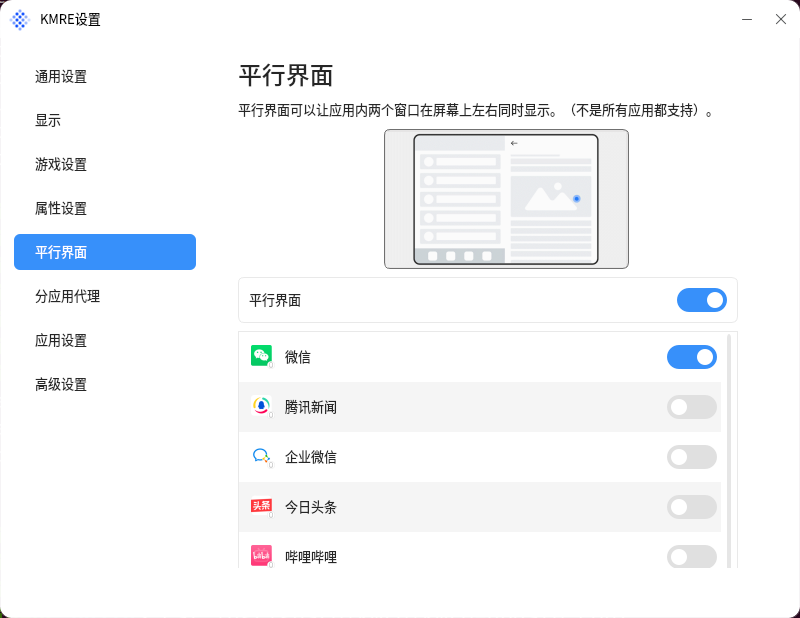
- 分应用代理设置：如图 11所示，设置应用是否单独使用网络代理。当系统网络代理已设置时，默认所有应用都使用代理网络，但打开此分应用代理开关后，应用之间将可独立设置是否使用代理。
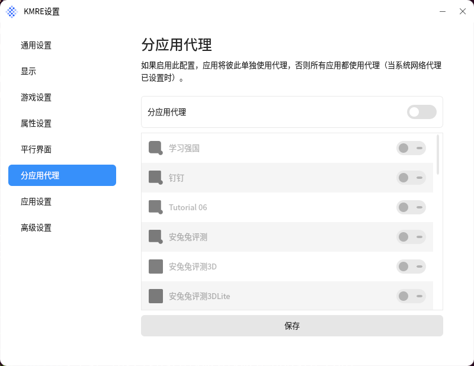
- 托盘设置：如图 12所示，设置应用是否显示托盘，应用设置托盘显示后，在标题栏点击关闭时，应用将不会退出运行。
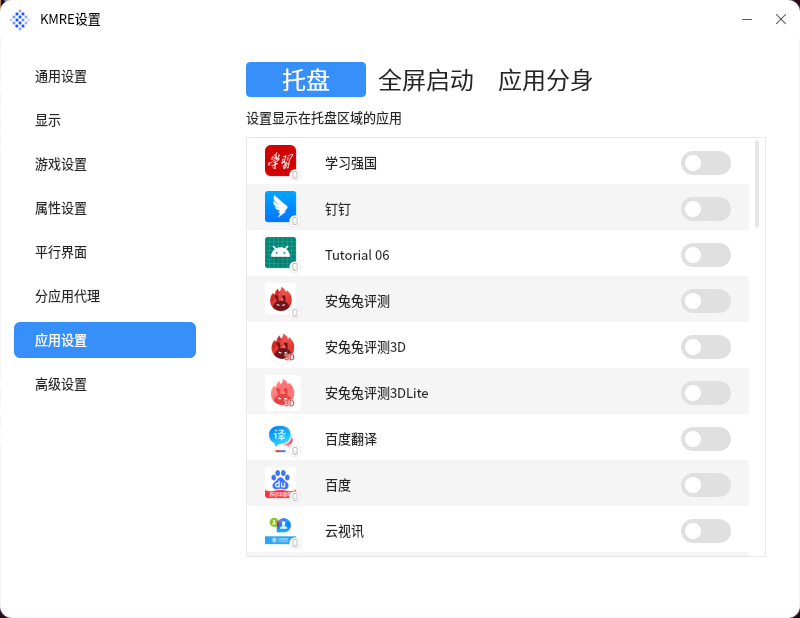
- 全屏启动设置：如图 13所示，设置应用是否全屏启动。应用设置全屏启动后，将在每次启动时以全屏的方式启动。
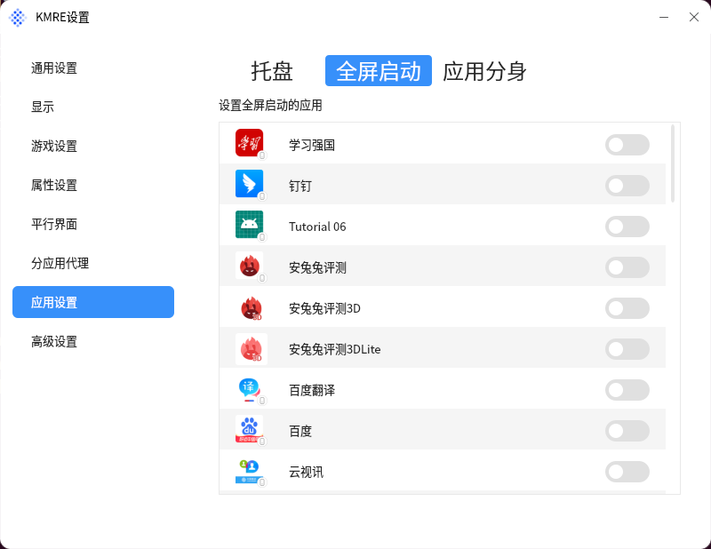
- 应用分身设置：如图 14所示，设置是否开启应用分身。应用分身开启后，将会创建另一个分身应用，可在该分身应用内登录不同账号。
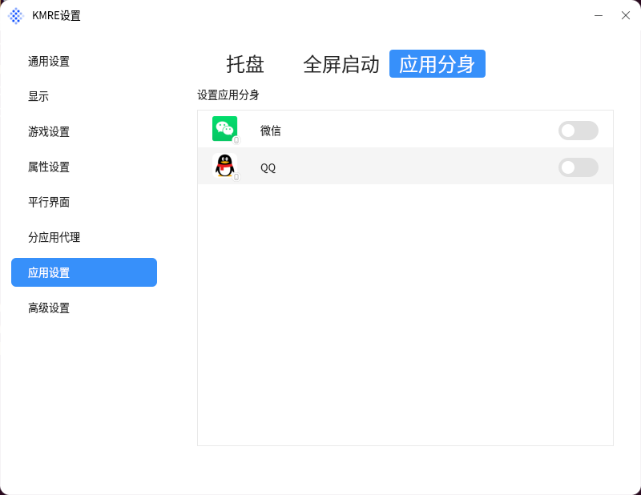
- 高级设置：如图 15所示，设置滚轮灵敏度、关闭KMRE环境、卸载KMRE环境，以及查看虚拟定位。
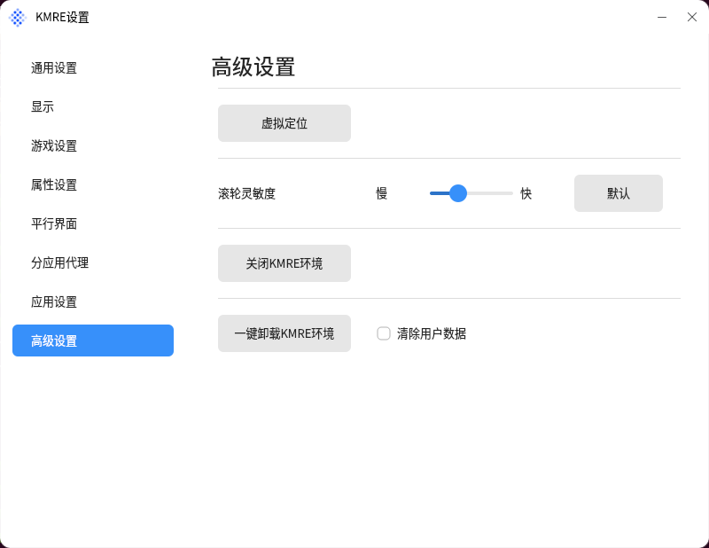
- 开发者调试：如图 16所示，在“通用设置”界面连续点击“当前版本xxx”按钮可开启“开发者模式”配置项，在该“开发者模式”配置项中可开启KMRE应用开发安装调试开关。
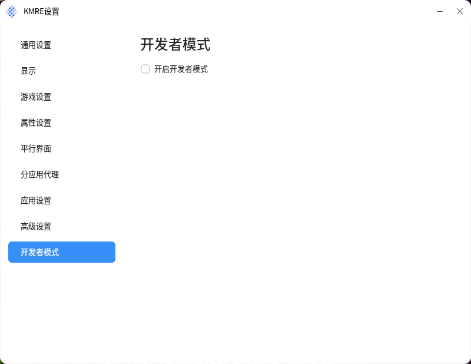
 

## 开发者模式调试
- 打开开发者调试：
1)连续点击通用设置->版本号5次即可显示开发者模式界面。
2)KMRE设置界面->开发者调试开关开启即可。
3)docker exec -it kmre-$UID-$USER ifconfig查看KMRE的IP地址。
4)通过adb connect IP 连接KMRE设备。
- 关闭开发者调试：打开KMRE设置界面->开发者调试开关关闭即可。
 
